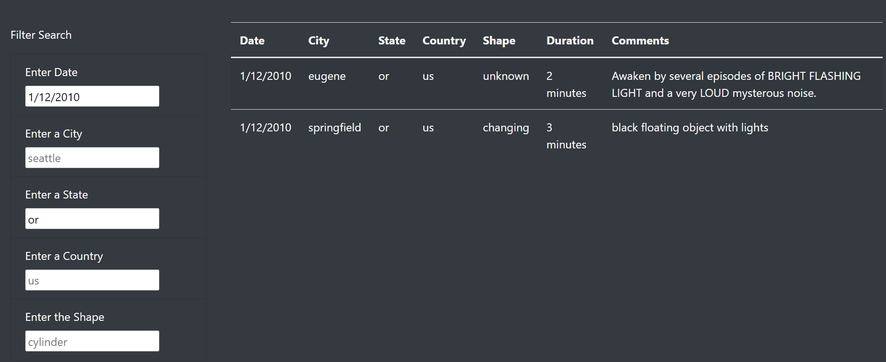

# UFOs
UFO sightings using JavaScript and bootstraps

## Overview of the Analysis
### Purpose

The purpose of this project was to build a dynamic website used to filter through data about UFO sightings. In order to provide in depth analysis of the sightings, the webpage has been designed so that any user may fitler through the data table on the following critiera (multiple criteria may be entered in the same search):
- Date of sighting
- City
- State
- Country
- Shape of UFO

## Results

#### UFO Sightings Webpage

The above image shows the created webpage with the table of all UFO sighting data. On the lower left-hand side is the filter criteria that users can input their search. Note that by clicking the header “UFO Sightings” in the top left-hand corner, it will refresh and reset the filtered data.

#### Filtered Search

This image shows an example of a search result on the table by using two filtering parameters. This search was made by filtering the UFO sightings by the state of Oregon, and on the date of 1/12/2010. The results of this filtered search showed that there were two UFO sightings in Oregon on that day. Note that the input of the state is in lowercase, to match the data provided in the table.

## Summary
### Points of Interest and Recommendations

Although the data table for UFO sightings around the country can successfully be filtered by several different search criteria, some drawbacks to this website have been identified. For example, the search only displays results if the search input is an exact match to the data in the table. This includes capitalization of letters in city and state names. Since all the data is written in lowercase, the search would not return any data if a user capitalized a city name. For example, an input of “Seattle” would not retrieve any UFO sightings, whereas inputting “seattle” would present the UFO data to the table. Updating the code to either turn all inputs lowercase, or to accept similar values would be beneficial. 	

To further develop this webpage, it could be recommended to change the city, state, and country filters to a dropdown menu instead of an input field. This could be an improvement because as is the user would have to know what city to search for in the data, or look through the data table ahead of time to see what cities are present. 
It would also be recommended that a clear filter button be added below the search criteria. As of now, clicking the top banner will do this, however a button would be more user friendly and visible. 
The ability to filter the table on a date range would also be useful instead of a single date. 

